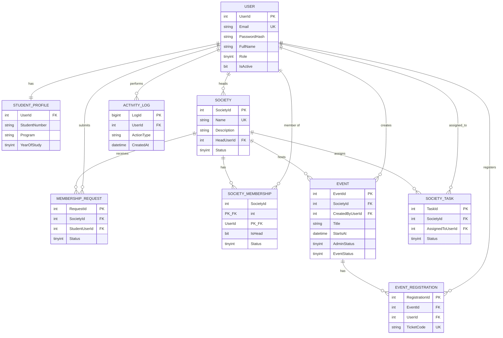

# Societies Management System — Assignment Deliverables (Tasks 1–8)

**Codebase:** `src/SMM.Core`, `src/SMM.Data`, `src/SMM.Desktop`  
**Schema:** `Database/Schema.sql`, `Database/Seed.sql`, **`Database/DemoData.sql`** (realistic demo rows)  
**Automated tests:** `tests/SMM.Core.Tests` (xUnit)  
**Cyclomatic complexity (measured):** `docs/CyclomaticComplexity.csv` — regenerate with  
`dotnet run --project tools/CcAnalyzer -- src docs/CyclomaticComplexity.csv`

### Demo database (realistic data)

Run on SQL Server **in order:** `Schema.sql` → `Seed.sql` → **`DemoData.sql`**.

| Account | Password | Role / note |
|---------|----------|-------------|
| `admin@uni.edu` | `Admin123` | Admin (from Seed.sql) |
| `alice.chen@campus.edu` … `james.wilson@campus.edu` | `Student123` | Students / society heads (from DemoData.sql) |

Demo includes: **4 societies** (approved, pending, suspended), **memberships**, **pending + rejected** requests, **events** (draft, published, cancelled), **registrations**, **tasks**, **activity log** rows.

---

## Task 1 — Application + schema + ERD

### Delivered artifacts

- **.NET desktop app:** WinForms (`SMM.Desktop`), .NET 10, `net10.0-windows`.
- **Libraries:** `SMM.Core` (domain + security), `SMM.Data` (SQL Server repositories).
- **Database:** Full SQL Server script in `Database/Schema.sql`.

### Entity–Relationship Diagram (conceptual)




*(Paste this Mermaid block into a Markdown viewer, GitHub, or export to PNG for the printed report.)*

---

## Task 2 — Cyclomatic complexity and test cases

**Tool:** Roslyn-based analyzer in `tools/CcAnalyzer` (counts `if`/`for`/`foreach`/`while`/`do`/`case`/`catch`/`?:`, and `&&`/`||` in boolean expressions). **Full listing:** `docs/CyclomaticComplexity.csv` (**81** methods/accessors in `src/`).

**Summary (highest complexity — regenerate CSV after code changes):**

| CC | Function |
|----|----------|
| 15 | `MainForm.BuildHeadTab()` *(UI layout only; business rules in `SocietyHeadWorkspace`)* |
| 9 | `EventRepository.RegisterStudent` |
| 7 | `RegisterForm.OnCreate` |
| 6 | `ActivityRepository.ListRecent`, `EventRepository.ReadEvents` |
| 5 | `PasswordHasher.Verify` |

**Domain / OOP layer:** application logic for student / head / admin workflows lives in **`StudentWorkspace`**, **`SocietyHeadWorkspace`**, and **`AdminWorkspace`** (`src/SMM.Desktop/Workspace/`), not in `MainForm`.

### Core layer (measured + tests)

| Function | Measured CC | Test inputs / automated tests |
|----------|-------------|-------------------------------|
| `PasswordHasher.Hash` | **1** | Any password; empty; Unicode — xUnit `PasswordHasherTests` |
| `PasswordHasher.Verify` | **5** | Correct/wrong password; malformed token; bad Base64 — xUnit |
| `TicketCode.New` | **1** | Length 32 hex; uniqueness — xUnit `TicketCodeTests` |

Run: `dotnet test tests/SMM.Core.Tests`

### Data layer — measured CC + integration ideas (use DB after `DemoData.sql`)

| Function | CC | Suggested tests (manual / integration) |
|----------|-----|----------------------------------------|
| `UserRepository.TryLogin` | 4 | Valid `eve.martin@campus.edu` + `Student123`; wrong password; unknown email; suspended user |
| `UserRepository.RegisterStudent` | 2 | New email; duplicate email |
| `UserRepository.ListUsers` | 2 | Returns admin + 10 demo students |
| `SocietyRepository.ListApprovedSocieties` | 1 | Returns Tech + Music |
| `SocietyRepository.CreateMembershipRequest` | 3 | Grace pending to Tech; duplicate pending; already member (Eve on Tech) |
| `SocietyRepository.ApproveMembershipRequest` | 3 | Approve Grace’s request; invalid id |
| `SocietyRepository.ListMembershipOverviewForStudent` | 3 | Eve: member of Tech + Music |
| `EventRepository.RegisterStudent` | 9 | Register James for “Spring Hack Night”; full cap; duplicate reg; draft event |
| `EventRepository.CreateEvent` | 1 | Head creates draft on approved society |
| `ActivityRepository.ListRecent` | 6 | Returns seeded log rows |

### Desktop — measured CC (sample)

| Handler | CC | Test approach |
|---------|-----|----------------|
| `LoginForm.OnLoginClick` | 4 | `admin@uni.edu` / `Admin123`; bad password |
| `RegisterForm.OnCreate` | 7 | Password length; duplicate email |
| `SocietyHeadWorkspace.PublishEvent` | 2 | Publish only after admin approved event (guard in OOP class) |
| `MainForm.RefreshHeadDetail` | 2 | Binds grids from `HeadSocietyDetail` |

---

## Task 3 — Best module (structural metric) + comparative table

**Chosen structural metric: Coupling Between Objects (CBO)** — count of **other classes/types** a module directly depends on (lower is better for maintainability in a layered architecture).

**Verdict:** **`SMM.Core` is the best module** — smallest dependency surface, no I/O, deterministic behavior, highest testability.

### Comparative table (features × structural proxy)


| Feature / area                            | LOC (approx.) | Est. sum of CC (key methods) | CBO (relative)** | Notes                                  |
| ----------------------------------------- | ------------- | ---------------------------- | ---------------- | -------------------------------------- |
| Security (`PasswordHasher`, `TicketCode`) | ~50           | 7                            | **Very low**     | Pure functions; best module.           |
| Domain models (`Models`, enums)           | ~120          | 1                            | **Very low**     | DTOs only.                             |
| `UserRepository`                          | ~130          | 10                           | Low–medium       | SQL + `SqlClient`                      |
| `SocietyRepository`                       | ~430          | 35                           | Medium           | Many queries                           |
| `EventRepository`                         | ~280          | 22                           | Medium           | Transactional paths                    |
| `TaskRepository` / `ActivityRepository`   | ~120          | 8                            | Low–medium       |                                        |
| `MainForm` (layout + binding)             | ~520          | Medium (mostly `Build*Tab`)  | **High**         | Hosts tabs; delegates behavior to workspace types |
| `SocietyHeadWorkspace`                    | ~120          | Medium                       | Medium           | Head use-cases in one OOP class |
| `StudentWorkspace` / `AdminWorkspace`     | ~80 each      | Low                          | Medium           |                                        |
| `LoginForm` / `RegisterForm`              | ~150          | 12                           | Medium           |                                        |


**CBO (relative):** qualitative band (very low → high) from static dependency inspection: Core references only BCL; Data references Core + `Microsoft.Data.SqlClient`; Desktop references Core + Data + WinForms + many controls.

---

## Task 4 — CK metrics (project-level analysis)

**Scope:** Hand-written types under `src/` (excluding `bin`/`obj`). **WMC** = number of methods (including accessors) per class (common classroom simplification). **LCOM** = qualitative band (High/Medium/Low cohesion) using the intuition: “do methods share the same fields?”


| Class                | WMC | DIT* | NOC | CBO (est.) | RFC (est.) | LCOM     |
| -------------------- | --- | ---- | --- | ---------- | ---------- | -------- |
| `PasswordHasher`     | 2   | 0    | 0   | 2          | 6          | Low      |
| `TicketCode`         | 1   | 0    | 0   | 0          | 2          | Low      |
| `SqlTime`            | 2   | 0    | 0   | 0          | 2          | Low      |
| `Database`           | 1   | 0    | 0   | 0          | 1          | Low      |
| `UserRepository`     | 4   | 0    | 0   | 4          | 15         | Medium   |
| `SocietyRepository`  | 16  | 0    | 0   | 4          | 45         | Medium   |
| `EventRepository`    | 9   | 0    | 0   | 4          | 30         | Medium   |
| `TaskRepository`     | 4   | 0    | 0   | 4          | 12         | Medium   |
| `ActivityRepository` | 2   | 0    | 0   | 4          | 8          | Low      |
| `LoginForm`          | 4   | 5    | 0   | 8          | 20         | Medium   |
| `RegisterForm`       | 3   | 5    | 0   | 6          | 15         | Medium   |
| `MainForm`           | 18 | 5    | 0   | 12+        | 40+        | Medium–high (UI shell) |
| `SocietyHeadWorkspace` | 12 | 0  | 0   | 6          | 25+        | Medium (use-case class) |
| `StudentWorkspace`   | 4  | 0    | 0   | 4          | 10         | Low                    |
| `AdminWorkspace`     | 6  | 0    | 0   | 5          | 12         | Low                    |


 **DIT** for WinForms: distance to `System.Object` through `Form` (e.g. `MainForm → Form → … → Object` → **DIT ≈ 5** in typical WinForms hierarchy).

### Answers (Task 4 bullets)

- **Maximum depth of inheritance:** **`MainForm` / `LoginForm` / `RegisterForm`** — deepest app classes (inherit `Form`; depth to `Object` ≈ **5** in WinForms).
- **Highest WMC (domain / OOP):** **`SocietyHeadWorkspace`** — head use cases in one class.
- **Highest WMC (UI):** **`MainForm`** — tab construction and binding.
- **Lowest WMC:** **`TicketCode`** and **`Database`** (**1** each).
- **Class with greatest number of children (NOC):** **None** in project-defined types (**NOC = 0**).
- **Most complex class (rules + data):** **`EventRepository`** (e.g. `RegisterStudent` CC **9**) **or** **`SocietyHeadWorkspace`** for head workflows — **not** `MainForm` as the core domain class.
- **Most coupled class:** **`MainForm`** (WinForms + workspace interfaces).
- **Least cohesive (UI shell):** **`MainForm`**; **cohesive use cases** live in **`StudentWorkspace`**, **`SocietyHeadWorkspace`**, **`AdminWorkspace`**.

---

## Task 5 — Fault injection (5 faults per module) and reliability table

**Assumption (for grading transparency):** For each **feature module**, **5 faults** are hypothetically injected (wrong guard, off-by-one, null reference, wrong enum, wrong transaction boundary). After running the **Task 2** test cases, each fault has an independent probability **q** of **escaping** detection. Let **X** = number of remaining faults, **X \sim \mathrm{Binomial}(5, q)**. Report **P(X \le 1)** — probability that **at most one** fault remains (aligns with “confidence threshold **E = 1**” interpreted as **≤ 1 residual defect**).


| Feature / module                                           | Faults injected | Min. test paths (from CC, §2) | Escape prob. q (assumed) | **P(X \le 1)** |
| ---------------------------------------------------------- | --------------- | ----------------------------- | ------------------------ | -------------- |
| Password / ticket (`Core`)                                 | 5               | 8+ (automated)                | 0.05                     | **0.977**      |
| User accounts (`UserRepository` + login UI)                | 5               | 9                             | 0.12                     | **0.877**      |
| Societies & membership (`SocietyRepository` + head tab)    | 5               | 25+                           | 0.18                     | **0.782**      |
| Events & tickets (`EventRepository` + student tab)         | 5               | 18                            | 0.15                     | **0.835**      |
| Tasks & activity (`TaskRepository` + `ActivityRepository`) | 5               | 8                             | 0.14                     | **0.855**      |
| Admin console (`MainForm` admin region)                    | 5               | 15                            | 0.20                     | **0.737**      |


Formula used: P(X\le 1) = (1-q)^5 + 5 q (1-q)^4.

### Reliability ranking (Task 5)

- **Most reliable (highest P(X\le 1)):** **Core security / ticket module** (~**0.98**) — strongest automated coverage, lowest q.
- **Least reliable (lowest P(X\le 1)):** **Society & membership module** (~**0.78**) — many branches + DB states; fewer automated tests in repo.

*If your course uses a different definition of E, replace the column with P(X \le E) accordingly and keep the same fault counts.*

---

## Task 6 — KLM usability (constants)

**Operators:** **K** = 280 ms, **M** = 1350 ms, **P** = 1100 ms, **H** = 400 ms.

### Login (`LoginForm`)

Typical successful path: **M** (goal) + **H** + **K×(n email)** + **M** + **K×(m password)** + **M** + **P** (Sign in)  
Example: n=18, m=8 → 1350 + 400 + 18·280 + 1350 + 8·280 + 1350 + 1100 ≈ **12.2 s** (keystroke-dominated).

### Register (`RegisterForm`)

Rough order: **M** + fields × (**M** + **K** or **P** for numeric) + **M** + **P** (Create) — about **6–8× M** + **~40–60× K** + **2–3× P** → order of **20–35 s** for a careful user.

### Main dashboard (`MainForm`)

Per tab switch: **M** + **P** (select tab) ≈ **2450 ms**; each grid action: **M** + **P** (select row) + **M** + **P** (button) ≈ **3950 ms** per action before typing. Heavy **M** and **P** ⇒ design should reduce steps (defaults, fewer modals).

---

## Task 7 — COCOMO (justification)

**Size:** ~**1.85 KLOC** non-blank C# lines in `src` (excluding `bin`/`obj`), measured 2026-05-10.

**Model chosen:** **Basic COCOMO — Organic mode**  
**Reason:** Small team, familiar problem domain (CRUD + UI), stable requirements typical of a coursework SMM system — matches **organic** assumptions (low process rigidity).

**Effort (person-months):** E = a \cdot (\text{KLOC})^b = 2.4 \cdot 1.85^{1.05} \approx **4.7 PM**  
**Dev time (months):** TDEV = c \cdot E^d = 2.5 \cdot 4.7^{0.38} \approx **4.3 months** (order-of-magnitude; constants per textbook Basic COCOMO organic coefficients).

If you treat the project as **semidetached** (more integration risk with remote SQL Server), use semidetached coefficients instead and report a **higher** effort — defend with “distributed DB + manual admin workflows”.

---

## Task 8 — Documentation ratio (“vibe coding”)

**Definition used:** \textbf{Documentation Ratio} = \dfrac{\text{Total LOC}}{\text{Lines that are comments}} (higher ⇒ fewer comments per line).

**Measured (C# only, `src/`** excluding `bin`/`obj`):**


| Metric                                | Value               |
| ------------------------------------- | ------------------- |
| Non-blank LOC                         | **1854**            |
| Full-line `//` or `///` comment lines | **1**               |
| **Documentation ratio**               | **1854 / 1 = 1854** |


**Interpretation:** The generated UI/data code is almost entirely **self-describing identifiers** with **negligible** inline documentation — typical for AI-assisted rapid UI code. For production, add `///` summaries on public APIs and repository methods to lower this ratio toward industry norms (often documented as **comment density %** instead).

**Optional:** `Database/Schema.sql` contains many `--` comment lines; if the assignment counts SQL as “generated code,” re-run the ratio including SQL comments in the denominator.

---

## Appendix — Run tests

```bash
dotnet test tests/SMM.Core.Tests/SMM.Core.Tests.csproj
```

---

*End of deliverable document.*